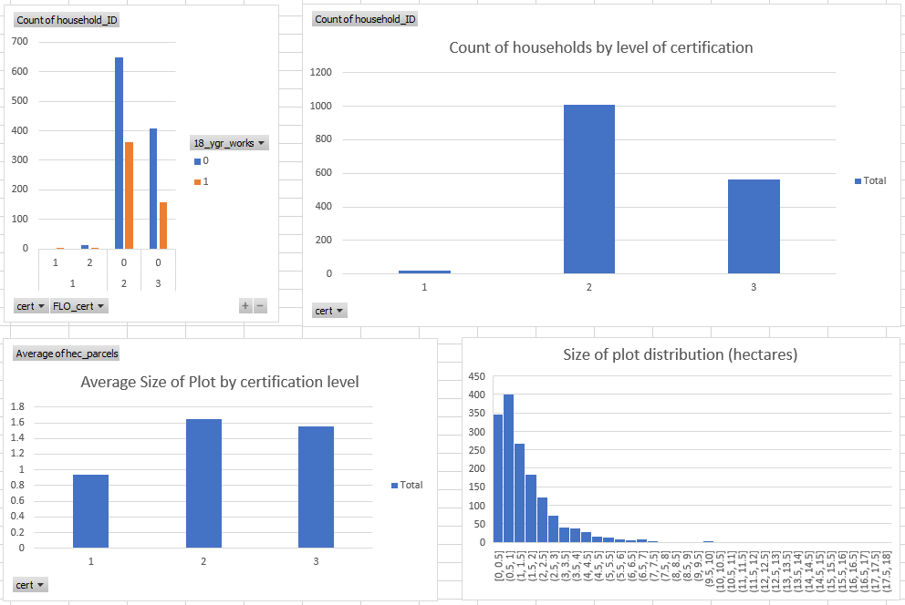

# MVP
Matt Ryan

For this project we are looking to evaluate coffee growers in Ethiopia and identify driving features related to likelihood of achieving fair-trade (FLO) certification, classify growers by these features, and ultimately identify probabilities of these growers in reaching FLO certification.

Before implementing any machine learning techniques, we are looking to simply identify FLO-fringe coffee producers via thorough EDA and manual feature selection. In the figure shown above, we have begun to organize growers by the level of certification, the size of the plots being worked, and whether or not children are employed. From here, we intend to begin employing machine learning techniques to predict the probability of whether or not a grower will become certified.